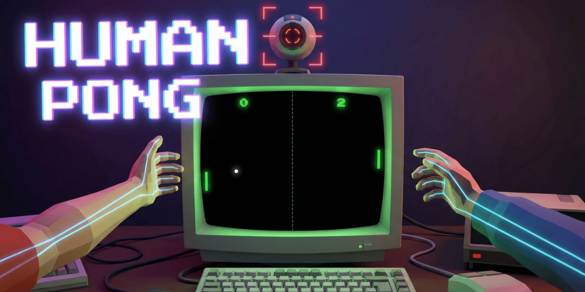

# HUMAN PONG

A retro 80s-style Pong game where you control the paddles with your body using your webcam. No controllers needed — just your hands or your head.



## Game Modes

### 2 Players — Both Hands
Each player raises one hand in front of the webcam. Move your hand up and down to control your paddle. Left hand = left paddle, right hand = right paddle.

### VS Computer — Hand
Control the left paddle with one hand while an AI opponent handles the right side. The AI reacts with a slight delay and makes occasional mistakes to keep things fair.

### VS Computer — Head
Control the left paddle with your head position. Crouch down to move the paddle lower, stand on your tiptoes to move it higher. The AI plays on the other side.

## How It Works

1. **Pick a mode** from the menu
2. **Allow webcam access** when prompted
3. **Calibration screen** — the game detects and locks onto your hands/face with a targeting reticle overlay
4. **Play!** — first to 11 points wins
5. If tracking is lost mid-game, the game **pauses automatically** and resumes once you're detected again

## Features

- Real-time hand tracking via **MediaPipe Hands**
- Face detection via **MediaPipe Face Detection**
- CRT visual effects (scanlines, vignette, neon glow)
- 8-bit sound effects generated with the **Web Audio API**
- Fullscreen support (press **F** or use the menu button)
- Auto-pause when tracking is lost
- Press **ESC** to return to the menu at any time

## Install & Run

```bash
# Clone the repo
git clone https://github.com/your-username/HumanPong.git
cd HumanPong

# Install dependencies
npm install

# Start dev server
npm run dev
```

Open the URL shown in the terminal (usually `http://localhost:5173`) in **Chrome** (recommended for best webcam + MediaPipe support).

### Production Build

```bash
npm run build
npm run preview
```

The built files are in `dist/`.

## Tech Stack

- **Vite** — build tool and dev server
- **MediaPipe Hands** — hand landmark detection
- **MediaPipe Face Detection** — face/nose tracking for head mode
- **Canvas 2D** — game rendering with neon glow effects
- **Web Audio API** — procedural 8-bit sounds
- **Google Fonts** — "Press Start 2P" pixel font

## Project Structure

```
├── index.html          # Single page with all screens
├── package.json
├── vite.config.js      # Vite + MediaPipe WASM file copy
└── src/
    ├── main.js         # Entry point, screens, calibration, pause
    ├── game.js         # Game loop, physics, scoring
    ├── hand.js         # MediaPipe Hands integration
    ├── head.js         # MediaPipe Face Detection integration
    ├── ai.js           # AI opponent logic
    ├── render.js       # Canvas rendering (paddles, ball, effects)
    ├── sound.js        # Web Audio API sound effects
    └── style.css       # Retro CRT styling
```

## License

MIT
